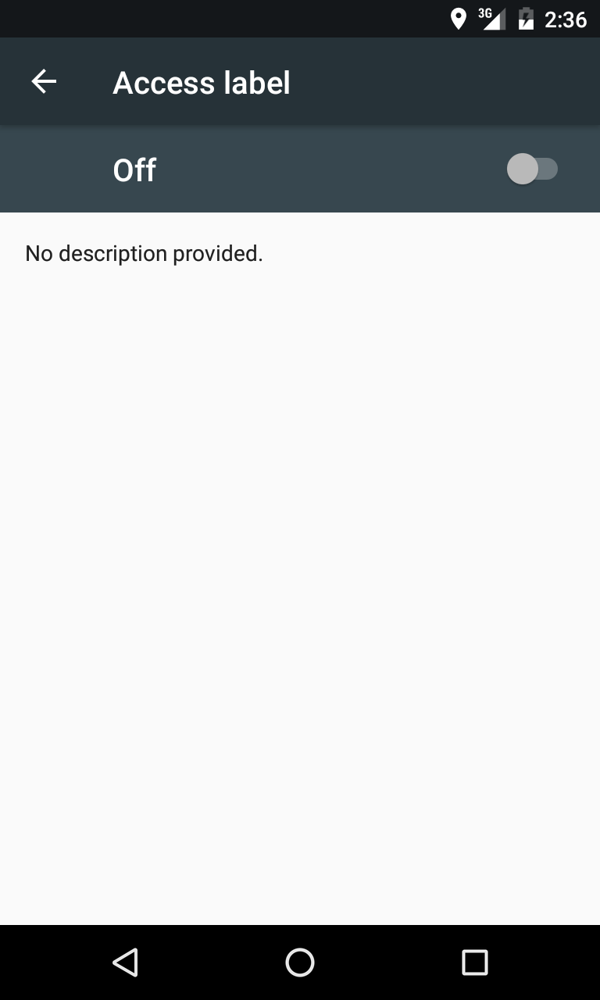

# AccessibilityServiceExample
Demo for getting key events outside the application

 
Accessibility services are intended to assist users with disabilities in using Android devices and apps, or I can say to get android os events like keyboard key press events 
or notification received events etc.
 
 
To Register your accessibility service,create a service which receives accessibility events
 
 

    public class MyAccessibilityService extends AccessibilityService {
        //Getting events   
        @Override
        public void onAccessibilityEvent(AccessibilityEvent accessibilityEvent) {
            ...
        }
        //interrupt service
        @Override
        public void onInterrupt() {
            ...
        } 
        // to register for which accessibilty service you need to register this service for
        @Override
        public void onServiceConnected() {
        }
    }
    
 
 
Inside AndroidManifest add this to bind your accessibility service with your application
    
    <uses-permission android:name="android.permission.BIND_ACCESSIBILITY_SERVICE" />
    
    <service android:name=".Service.MyAccessibilityService"
         android:label="@string/accessibility_service_label"
         android:permission="android.permission.BIND_ACCESSIBILITY_SERVICE">
         <intent-filter>
               <action android:name="android.accessibilityservice.AccessibilityService" />
         </intent-filter>
    
         
         <meta-data
                 android:name="android.accessibilityservice"
                 android:resource="@xml/accessibility_service_config" />
    
    </service>
    
 
 
Create Accesiblity config file, add accessiblity event types which types of events you want to get inside your service like key events (Text Changed event) ,window state change events,
notification events etc. If you want to filter the application from which service gets events like whatsapp or facebook then add packagenames seperated by comma. 
 

    <?xml version="1.0" encoding="utf-8"?>
    <accessibility-service xmlns:android="http://schemas.android.com/apk/res/android"
        android:description="@string/accessibility_service_description"
        android:packageNames=""
        android:accessibilityEventTypes="typeAllMask"
        android:accessibilityFlags="flagDefault"
        android:accessibilityFeedbackType="feedbackGeneric"
        android:notificationTimeout="100"
        android:canRetrieveWindowContent="true"
        android:canRequestFilterKeyEvents="true"
        android:settingsActivity="" />

 
 
Add description in strings the label you want to show in accessiblity service and description 
 
    <string name="accessibility_service_label">Access label</string>
    <string name="accessibility_service_description">Service Description</string>
 

 
 

# **How to check if service enabled or not**

 
    /**
     * Check if Accessibility Service is enabled.
     *
     * @param mContext
     * @return <code>true</code> if Accessibility Service is ON, otherwise <code>false</code>
     */
    public static boolean isAccessibilitySettingsOn(Context mContext) {
        int accessibilityEnabled = 0;
        //your package /   accesibility service path/class
        final String service = "com.example.sotsys_014.accessibilityexample/com.accessibilityexample.Service.MyAccessibilityService";

        boolean accessibilityFound = false;
        try {
            accessibilityEnabled = Settings.Secure.getInt(
                    mContext.getApplicationContext().getContentResolver(),
                    android.provider.Settings.Secure.ACCESSIBILITY_ENABLED);
            Log.v(TAG, "accessibilityEnabled = " + accessibilityEnabled);
        } catch (Settings.SettingNotFoundException e) {
            Log.e(TAG, "Error finding setting, default accessibility to not found: "
                    + e.getMessage());
        }
        TextUtils.SimpleStringSplitter mStringColonSplitter = new TextUtils.SimpleStringSplitter(':');

        if (accessibilityEnabled == 1) {
            Log.v(TAG, "***ACCESSIBILIY IS ENABLED*** -----------------");
            String settingValue = Settings.Secure.getString(
                    mContext.getApplicationContext().getContentResolver(),
                    Settings.Secure.ENABLED_ACCESSIBILITY_SERVICES);
            if (settingValue != null) {
                TextUtils.SimpleStringSplitter splitter = mStringColonSplitter;
                splitter.setString(settingValue);
                while (splitter.hasNext()) {
                    String accessabilityService = splitter.next();

                    Log.v(TAG, "-------------- > accessabilityService :: " + accessabilityService);
                    if (accessabilityService.equalsIgnoreCase(service)) {
                        Log.v(TAG, "We've found the correct setting - accessibility is switched on!");
                        return true;
                    }
                }
            }
        } else {
            Log.v(TAG, "***ACCESSIBILIY IS DISABLED***");
        }

        return accessibilityFound;
    }

